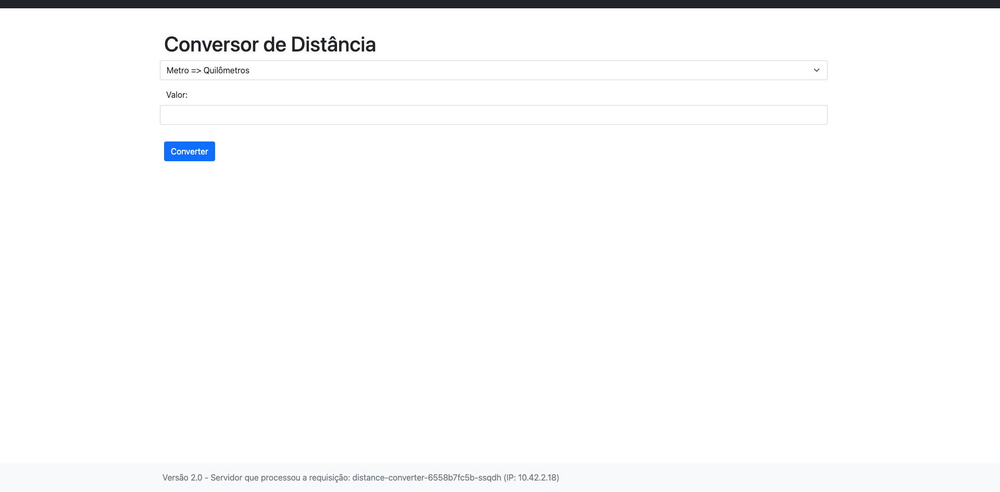

# Conversor de unidades (Distance Converter)



<br>
<br>
Este repositório foi criado como parte do **Desafio DevOps & Cloud**, onde será demonstrado o processo completo de deploy de uma aplicação, desde a configuração inicial até a implantação na AWS. O objetivo é implementar e gerenciar o deploy utilizando as melhores práticas e ferramentas modernas de DevOps.

## Objetivo do Projeto

Criar uma aplicação que converte distâncias entre diferentes unidades de medida (ex.: milhas para quilômetros) e realizar o deploy completo na AWS utilizando as ferramentas e tecnologias abaixo:

### Ferramentas e Tecnologias
- **Docker**: Containerização da aplicação.
- **Kubernetes**: Orquestração de containers.
- **AWS**: (em desenvolvimento)
- **GitHub Actions**: (em desenvolvimento)
- **Prometheus**: (em desenvolvimento)
- **Grafana**: (em desenvolvimento)
- **Pipelines CI/CD**: (em desenvolvimento)

## Estrutura do Projeto

O repositório está estruturado da seguinte forma:

```plaintext
.
├── ops/
│   ├── docker/
│   │   └── Dockerfile          # Configuração do container Docker
│   ├── kubernetes/
│   │   └── deployment.yaml     # Configuração de deployment no Kubernetes
├── templates/                  # (em desenvolvimento)
├── .editorconfig               # Configurações de editor
├── .gitignore                  # Arquivos ignorados pelo Git
├── app.py                      # Código-fonte principal
├── README.md                   # Documentação do projeto
├── requirements.txt            # Dependências do projeto
```

## Funcionalidades

1. **Conversão de Distâncias:**
   - Permite a conversão de diferentes unidades de medida de distância, como quilômetros, milhas, metros, etc. (em desenvolvimento)
2. **API:**
   - Uma API REST para realizar as conversões programaticamente. (em desenvolvimento)
3. **Monitoramento:**
   - Métricas detalhadas da aplicação coletadas pelo Prometheus e visualizadas no Grafana. (em desenvolvimento)
4. **CI/CD:**
   - Pipeline automatizado para build, teste e deploy. (em desenvolvimento)

## Fluxo do Deploy

1. **Containerização com Docker:**
   - Construir a imagem Docker da aplicação utilizando o `Dockerfile`.
2. **Orquestração com Kubernetes:**
   - Configurar o deploy utilizando o arquivo `deployment.yaml`.
3. **Demais etapas (em desenvolvimento):**
   - AWS, GitHub Actions, Prometheus, Grafana e CI/CD serão implementados ao longo da semana.

## Como Executar Localmente

1. Clone o repositório:
   ```bash
   git clone https://github.com/felipepanegalli/ms-cloud-distance-converter.git
   ```
2. Acesse o diretório do projeto:
   ```bash
   cd ms-cloud-distance-converter
   ```
3. Construa a imagem Docker:
   ```bash
   docker build -t ms-cloud-distance-converter ./ops/docker
   ```
4. Execute o container:
   ```bash
   docker run -p 8080:8080 ms-cloud-distance-converter
   ```
5. Acesse a aplicação localmente em `http://localhost:8080`.

## Como Contribuir

1. Faça um fork do projeto.
2. Crie uma branch com sua feature ou correção: `git checkout -b minha-feature`.
3. Realize o commit das alterações: `git commit -m 'Minha nova feature'`.
4. Envie as alterações para o repositório remoto: `git push origin minha-feature`.
5. Abra um Pull Request.

## Autor do projeto

**Fabrício Veronez**  
GitHub: [fabricioveronez](https://github.com/fabricioveronez)<br>
Projeto Original: [Repositório Original](https://github.com/KubeDev/desafio-devops-cloud)